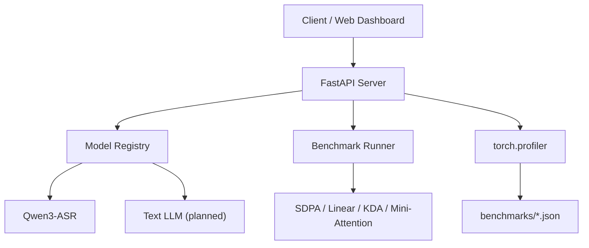

# Blackwell Inference Server

[](LICENSE)
[](https://www.python.org/downloads/)
[](https://developer.nvidia.com/cuda-toolkit)

> OpenAI-compatible inference server optimized for consumer Blackwell GPUs (RTX 5070 Ti, SM120) — custom attention kernels, Qwen3-ASR acceleration, and reproducible benchmarks.

---

## Why this project exists

Consumer Blackwell (SM120) is poorly served by existing inference stacks:

- CUTLASS Blackwell FMHA targets sm100a, not sm120
- FlashAttention 2.x does not officially support sm120
- vLLM 0.14.0 pins an older torch that breaks on this card
- WSL2 blocks ncu/nsys kernel profiling

**Blackwell Inference Server** packages working attention kernels, torch.compile recipes, and a FastAPI server so you can run high-performance LLM/ASR inference on a single RTX 5070 Ti.

---

## Features

- **OpenAI-compatible API**
  - `POST /v1/audio/transcriptions` — Qwen3-ASR speech-to-text
  - `POST /v1/chat/completions` — text LLM with optional n-gram speculative decoding
  - `GET /v1/models` — list loaded models
- **Benchmark API**
  - `POST /v1/benchmark` — run attention/ASR benchmarks
  - `GET /v1/profile` — torch.profiler kernel traces
  - `GET /v1/profiles` — list saved profiles
- **Web dashboard** — built-in UI for benchmarks and transcription
- **Attention backends** — SDPA / Triton linear attention / raw CUDA KDA / Mini-Attention SM120
- **Dockerfile** — provided for containerized deployment

---

## Quick start

### 1. Install

```bash
git clone https://github.com/Leslie360/blackwell-inference-server.git
cd blackwell-inference-server
pip install -e .[asr,server]
```

### 2. Run server

```bash
blackwell-serve \
  --asr-model /path/to/Qwen3-ASR-0.6B \
  --llm-model /path/to/Qwen3-0.6B \
  --compile \
  --host 0.0.0.0 --port 8000
```

Open `http://localhost:8000` for the dashboard.

### 3. Call the API

```bash
# Transcribe audio
curl -X POST http://localhost:8000/v1/audio/transcriptions \
  -F "file=@audio.wav"

# Chat with speculative decoding
curl -X POST http://localhost:8000/v1/chat/completions \
  -H "Content-Type: application/json" \
  -d '{"model":"qwen3-text","messages":[{"role":"user","content":"hello"}],"use_spec":true}'

# Run attention benchmark
curl -X POST http://localhost:8000/v1/benchmark \
  -H "Content-Type: application/json" \
  -d '{"task":"attention","backend":"sdpa","seq_len":2048}'

# Run ASR benchmark
curl -X POST http://localhost:8000/v1/benchmark \
  -H "Content-Type: application/json" \
  -d '{"task":"asr","backend":"compile","model":"/path/to/Qwen3-ASR-0.6B","audio":"/path/to/audio.wav"}'
```

### 4. Docker

```bash
docker compose up --build
```

### 5. Read the story

[技术博客：在 RTX 5070 Ti 上自建 OpenAI 兼容推理服务](docs/BLOG.md)

---

## Benchmarks (RTX 5070 Ti)

### Attention (N=2048, B=1, H=8)

| Backend | Latency | TFLOPS | Note |
|---------|--------:|-------:|------|
| SDPA | 0.109 ms | 78.7 | cuDNN flash attention |
| linear | 0.064 ms | 67.0 | Triton chunked linear attention |
| KDA | 2.660 ms | 1.6 | raw CUDA educational kernel |
| mini | 0.250 ms | 68.7 | SM120 mma.sync kernel |

### Qwen3-ASR-0.6B

| Config | Latency | Throughput |
|--------|--------:|-----------:|
| baseline | 0.671 s | 22.4× realtime |
| torch.compile | **0.266 s** | **56.6× realtime** |

### Speculative decoding (Qwen3-0.6B, greedy)

| Prompt type | Baseline tok/s | N-gram spec tok/s | Speedup | Acceptance |
|-------------|---------------:|------------------:|--------:|-----------:|
| Highly repetitive (20× repeat) | 85.3 | **301.2** | **3.53×** | 98.6% |
| General creative prompt | 83.4 | 78.2 | 0.94× | 4.2% |

N-gram self-speculation works when output is repetitive/structured; it adds negligible overhead otherwise.

---

## Architecture



```
src/blackwell_inference/
├── attention/          # attention backends (sdpa, linear, kda, mini)
├── asr/                # Qwen3-ASR wrapper
├── bench/              # benchmark runners + CLIs
├── serve/              # FastAPI server + dashboard
│   ├── app.py          # OpenAI-compatible API
│   ├── models.py       # model registry
│   ├── schemas.py      # request/response models
│   └── static/         # web dashboard
├── spec/               # speculative decoding (placeholder)
└── utils/
tests/                  # pytest
benchmarks/             # JSON results
docs/                   # design, performance, roadmap
Dockerfile              # containerized deployment
docker-compose.yml
```

---

## Performance analysis

`ncu`/`nsys` cannot capture CUDA kernel traces on WSL2 + SM120. All kernel-level evidence uses `torch.profiler`; see `docs/PERFORMANCE.md`.

---

## Roadmap

- **v0.2** — GitHub Actions CI, PyPI release, benchmark dashboard
- **v0.3** — text LLM support (Qwen3-0.6B/1.7B)
- **v0.4** — EAGLE / n-gram speculative decoding
- **v1.0** — SGLang/vLLM integration examples, Hugging Face Spaces demo

---

## Contributing

Contributions are welcome. Please open an issue or pull request.

1. Fork the repository
2. Create a feature branch
3. Run tests: `pytest`
4. Submit a PR

---

## License

MIT
